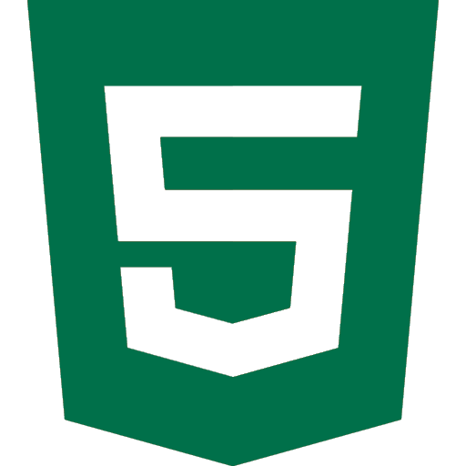
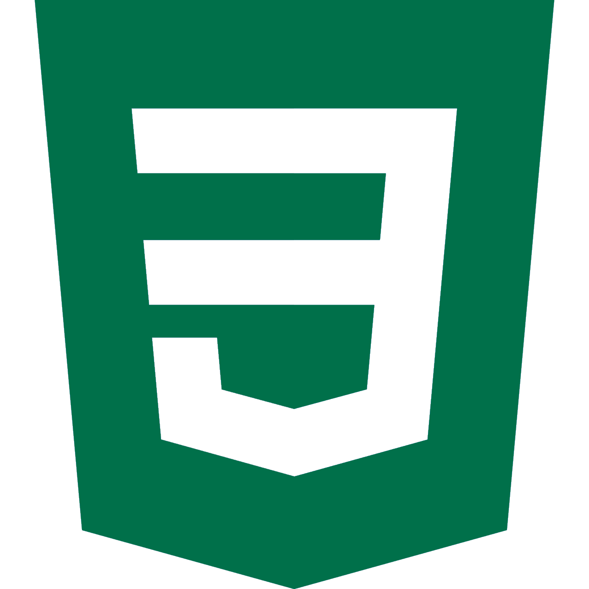
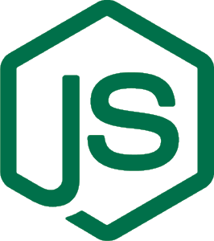
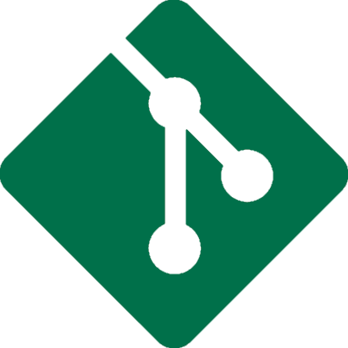

<h2 align="center">
  Hi there, <strong>I'm Carlos - StarbuckBarista</strong> 
</h2>

  I'm a student, developer, and freelancer that's been programming for just over six years.
   

<h3 align="center">
  Connect With Me
</h3>

  
  &nbsp;
  
  &nbsp;
  
  &nbsp;
  

<h3 align="center">
  Languages and Tools I Use
</h3>

  
  &nbsp;
  
  &nbsp;
  
  &nbsp;
  
  &nbsp;
  
  &nbsp;
  
  &nbsp;
  
  &nbsp;
  

<h3 align="center">
  GitHub Statistics
</h3>

    
    

<h3 align="center">
  Recent Activity
</h3>

  

<!-- ACTIVITY_START -->
&nbsp; Pushed 2 commits to [StarbuckBarista/profile-activity](https://api.github.com/repos/StarbuckBarista/profile-activity)

&nbsp; Pushed 7 commits to [StarbuckBarista/StarbuckBarista](https://api.github.com/repos/StarbuckBarista/StarbuckBarista)

&nbsp; Pushed 3 commits to [StarbuckBarista/profile-activity](https://api.github.com/repos/StarbuckBarista/profile-activity)

&nbsp; Pushed 2 commits to [StarbuckBarista/StarbuckBarista](https://api.github.com/repos/StarbuckBarista/StarbuckBarista)

&nbsp; Pushed 33 commits to [FIRST1939/Reefscape2025](https://api.github.com/repos/FIRST1939/Reefscape2025)

&nbsp; Closed [Pull Request #24](https://github.com/FIRST1939/Reefscape2025/pull/24) in [FIRST1939/Reefscape2025](https://api.github.com/repos/FIRST1939/Reefscape2025)

&nbsp; Opened [Pull Request #24](https://github.com/FIRST1939/Reefscape2025/pull/24) in [FIRST1939/Reefscape2025](https://api.github.com/repos/FIRST1939/Reefscape2025)

<!-- ACTIVITY_END -->
