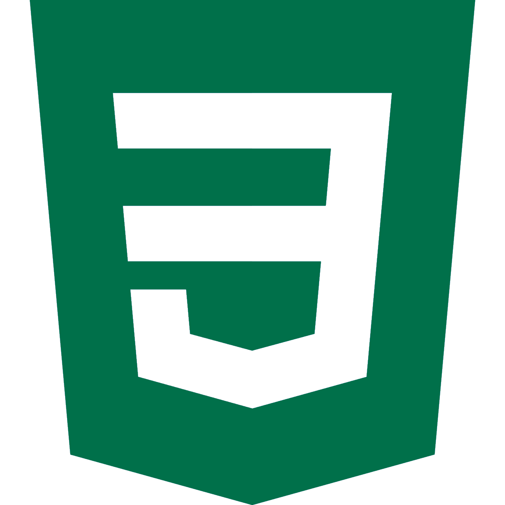
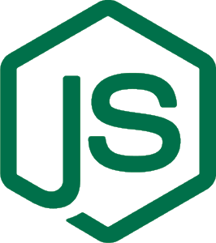
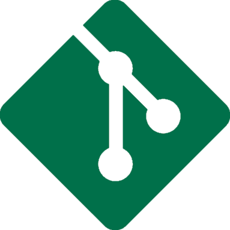

<h2 align="center">
  Hi there, <strong>I'm Carlos - StarbuckBarista</strong> 
</h2>

  I'm a student, developer, and freelancer that's been programming for just over five years.
    
  

<h3 align="center">
  Connect With Me
</h3>

  
  &nbsp;
  
  &nbsp;
  
  &nbsp;
  

<h3 align="center">
  Languages and Tools I Use
</h3>

  
  &nbsp;
  
  &nbsp;
  
  &nbsp;
  
  &nbsp;
  
  &nbsp;
  
  &nbsp;
  
  &nbsp;
  

<h3 align="center">
  GitHub Statistics
</h3>

    
    

<h3 align="center">
  Recent Activity
</h3>

  <!--START_SECTION:activity-->
1. ❗️ Opened issue <a href="https://github.com/OUT-Guild/OUT-Bot/issues/16">#16</a> in <a href="https://github.com/OUT-Guild/OUT-Bot">OUT-Guild/OUT-Bot</a>
  <!--END_SECTION:activity-->

